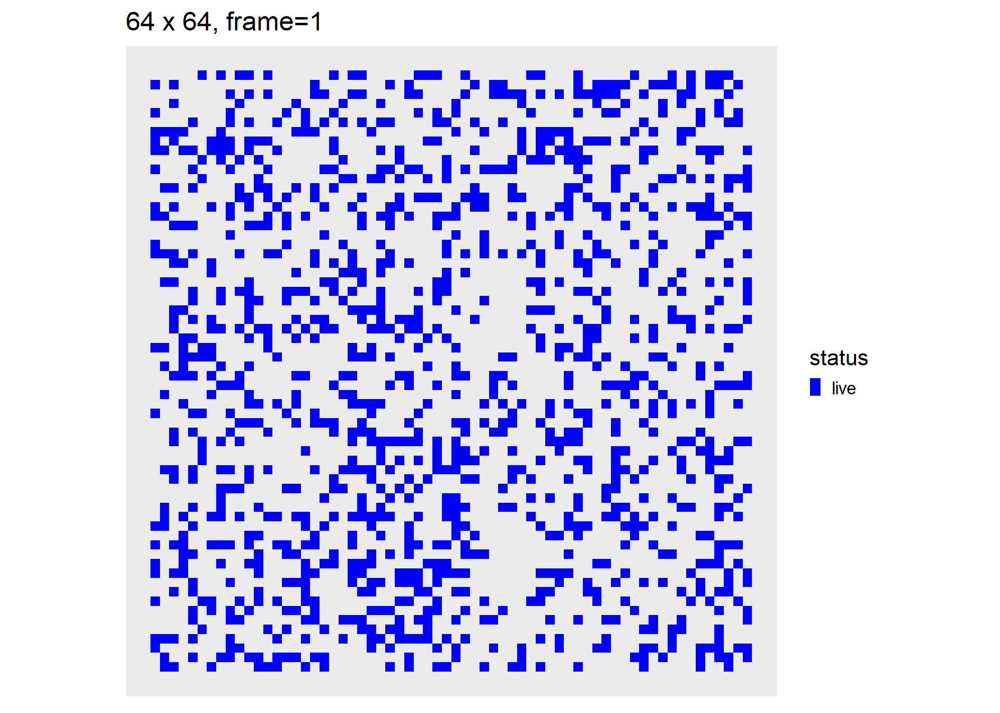
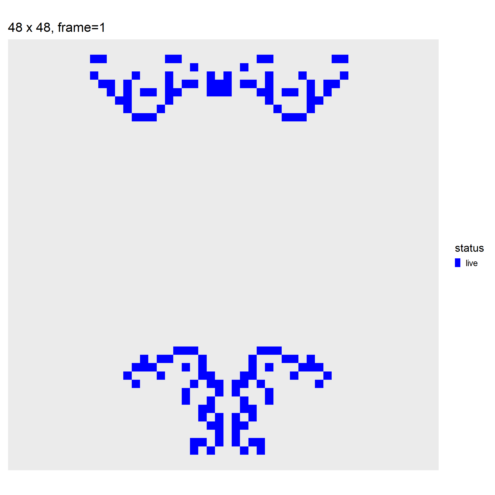

# Conway's "Game of Life" w/ `tibble()` logic

The [Game of Life](https://en.wikipedia.org/wiki/Conway%27s_Game_of_Life) is a cellular automaton devised by the British mathematician John H. Conway in 1970.

## Survival rules:

- A live cell survives if it has 2 or 3 neighbors, else it dies
- A dead cell is "born" if it has exactly 3 neighbors.

## R Implementation

The code below will use `tibbles()` and sparse matrices to evolve an initial random configuration of alive cells. All update logic is in file `conway.R` included in the project.

```{r libraries,message=F}
suppressMessages(library(tidyverse))
suppressMessages(library(Matrix))
library(fs)
library(magick)
library(tictoc)
```

All logic resides on this file:

```{r}
source("conway.R")
```

Create and plot random array:

```{r,out.width='50%'}
df_rand <- random_df(50,.1)
df_rand %>% plot_df
```

Run one step of the Conway algo (see `conway.R`). Surviving cells are shown "blue" and newborn ones "red" (see "Survival Rules" above):

```{r,out.width='50%'}
df_rand %>% conway_step %>% plot_df
```

Create 64 x 64 random array, 33% filled-out, evolve it over 64 Conway steps:

```{r rand-sim,cache=T,message=F,results='hide'}
set.seed(1)
side <- 64
df_sim_rand <- random_df(side,.33) %>% conway_sim(64)
```

```{r animate-rand,eval=F,echo=F,fig.show='animate'}
# not working, requires ffmpeg
df_sim_rand %>% walk(~print(plot_df(.x)))
```

```{r create-anim-gif,eval=F,echo=F,message=F,cache=T}
df_sim_rand %>% make_anim_gif("conway.gif")
```

```{r,eval=T,echo=F,out.width='50%'}

```

## Spaceship Gliders

A [spaceship glider](https://en.wikipedia.org/wiki/Spaceship_(cellular_automaton)) is a pattern which reappears after a certain number of generations (period) in the same orientation but in a different position.

Here we will hand-pixelate the "light" glider and translate it to the top-left corner of the array.

```{r,out.width='50%'}
df_glider0 <- tribble(~i,~j,
                        1,1,
                        2,1,
                        3,1,
                        3,2,
                        2,3) %>%
  mutate(status="live")
df_gliders <- df_glider0 %>%
  mutate(j=j+27)
attr(df_gliders,"width") <- 30

df_gliders %>% plot_df
```

Evolve its position over 120 Conway steps:

```{r glider-sim,cache=T,message=F,results='hide'}
df_sim_glider <- df_gliders %>% conway_sim(120)
```

Notice its periodic motion:

```{r animate-glider,eval=F,echo=F,fig.show='animate',interval=0.1, aniopts="controls,loop"}
# not working, requires ffmpeg
df_sim_glider %>% walk(~plot_df(.x))
```

```{r,eval=F,echo=F,message=F,cache=T}
df_sim_glider %>% make_anim_gif("gliders.gif",fps=10)
```

```{r eval=T,echo=F,out.width='50%'}
knitr::include_graphics("gliders.gif")
```

## Gosper's Glider Gun

A "gun" is a pattern w/ a main part that repeats periodically, like an oscillator, and that also periodically emits spaceships.

Below we hand pixelate [Gosper's Glider Gun](https://en.wikipedia.org/wiki/Gun_(cellular_automaton)) and translate it to the top-left corner:

```{r,out.width='50%'}
df_glider_gun0 <-
  tribble(~i,~j,
          2,5,3,5,2,6,3,6,
          #
          12,4,12,5,12,6,13,3,13,7,14,2,14,8,
          15,2,15,8,16,5,17,3,17,7,
          18,4,18,5,18,6,19,5,
          #
          22,6,22,7,22,8,23,6,23,7,23,8,
          24,5,24,9,
          #
          26,4,26,5,26,9,26,10,
          #
          36,7,36,8,37,7,37,8) %>%
  mutate(status="live")
df_glider_gun <- df_glider_gun0 %>%
  mutate(j=j+54)
attr(df_glider_gun,"width") <- 64

df_glider_gun %>% plot_df
```

Evolving its position over 240 Conway steps:

```{r glider-gun-sim,cache=T,message=F,results='hide'}
df_sim_gun <- df_glider_gun %>% conway_sim(240)
```

Gosper's Gun is self-preserving and periodically spawns a stream of light gliders:

```{r animate-gun,eval=F,echo=F,fig.show='animate'}
# not working, requires ffmpeg
df_sim_gun %>% walk(~print(plot_df(.x)))
```

```{r,eval=F,echo=F,message=F,cache=T}
df_sim_gun %>% make_anim_gif("glider_gun.gif",fps=10)
```

```{r,eval=T,echo=F,out.width='50%'}
knitr::include_graphics("glider_gun.gif")
```

## Large Spaceship

Larger creatures are represented in a run-length encoded (aka. [RLE](http://www.conwaylife.com/wiki/Run_Length_Encoded)) format. File `rle.R` contains some utility functions to convert from this format to `tibble`.

```{r}
source("rle.R")
```

For example, a 72-cell spaceship is represented by the following rle:

```{r}
rle_ship24 <- "6b3o7b3o$2bob2o3bo5bo3b2obo$b3o3bobo5bobo3b3o$o3bo4b2o3b2o4bo3bo$bo6bob2ob2obo6bo$7bo3bobo3bo$7bo2bo3bo2bo2$9b2o3b2o$9bobobobo$10b2ob2o$11bobo$8b2obobob2o$8bobo3bobo!"
```

Its appearance is as follows:

```{r,echo=F,out.width='50%'}
plot_rle(rle_ship24,"rle_ship24")
```

It turns out the above beast dies shortly after its released. On the other hand, the spaceship below is self-preserving and will glide indefinitely:

```{r}
rle_ship64 <- "5b3o15b3o5b$4bo3bo13bo3bo4b$3b2o4bo11bo4b2o3b$2bobob2ob2o3b3o3b2ob2obobo2b$b2obo4bob2ob3ob2obo4bob2ob$o4bo3bo4bobo4bo3bo4bo$12bo5bo12b$2o7b2o9b2o7b2o!"
```

```{r,echo=F,out.width='50%'}
plot_rle(rle_ship64,"rle_ship64")
```

We will place both face-to-face on a 48x48 array:

```{r,out.width='50%'}
df_ship <- rle2df(rle_ship64) %>%
  mutate(j=j+40,i=i+8) %>%
  bind_rows(rle2df(rle_ship24)%>%
              mutate(i=i+12,j=14-j))
attr(df_ship,"width") <- 48
df_ship %>% plot_df
```

And run 80 steps of a Conway simulation:

```{r ship-sim,cache=T,message=F,results='hide'}
df_sim_ship <- df_ship %>% conway_sim(80)
```

```{r,eval=F,echo=F,message=F,cache=T}
df_sim_ship %>% make_anim_gif("ship.gif",fps=10)
```

And watch the critters collide against :

```{r,eval=T,echo=F,out.width='50%'}

```