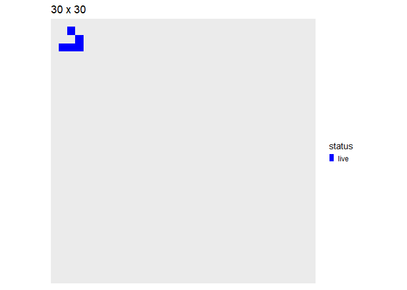

# Conway’s “Game of Life” w/ `tibble()` logic

The [Game of
Life](https://en.wikipedia.org/wiki/Conway%27s_Game_of_Life) is a
cellular automaton devised by the British mathematician John H. Conway
in 1970.

## Survival rules:

  - A live cell survives if it has 2 or 3 neighbors, else it dies
  - A dead cell is “born” if it has exactly 3 neighbors.

## R Implementation

The code below will use `tibbles()` and sparse matrices to evolve an
initial random configuration of alive cells. All update logic is in file
`conway.R` included in the project.

``` r
suppressMessages(library(tidyverse))
suppressMessages(library(Matrix))
library(fs)
library(magick)
library(tictoc)
```

All logic resides on this file:

``` r
source("conway.R")
```

Create and plot random array:

``` r
df_rand <- random_df(50,.1)
df_rand %>% plot_df
```

<!-- -->

Run one step of the Conway algo (see `conway.R`). Surviving cells are
shown “blue” and newborn ones “red” (see “Survival Rules” above):

``` r
df_rand %>% conway_step %>% plot_df
```

<!-- -->

Create 64 x 64 random array, 33% filled-out, evolve it over 64 Conway
steps:

``` r
set.seed(1)
side <- 64
df_sim_rand <- random_df(side,.33) %>% conway_sim(64)
```

``` r
df_sim_rand %>% make_anim_gif("conway.gif")
```


# [Spaceship](https://en.wikipedia.org/wiki/Conway%27s_Game_of_Life) “gliders”

Build simple glider, place it on the top-left-corner of space:

``` r
df_glider0 <- tribble(~i,~j,
                        1,1,
                        2,1,
                        3,1,
                        3,2,
                        2,3) %>%
  mutate(status="live")
df_gliders <- df_glider0 %>%
  mutate(j=j+27)
attr(df_gliders,"width") <- 30

df_gliders %>% plot_df
```

<!-- -->

Evolve its position over 120 Conway steps:

``` r
df_sim_gliders <- df_gliders %>% conway_sim(120)
```

``` r
df_sim_gliders %>%
  make_anim_gif("gliders.gif",fps=6)
```


