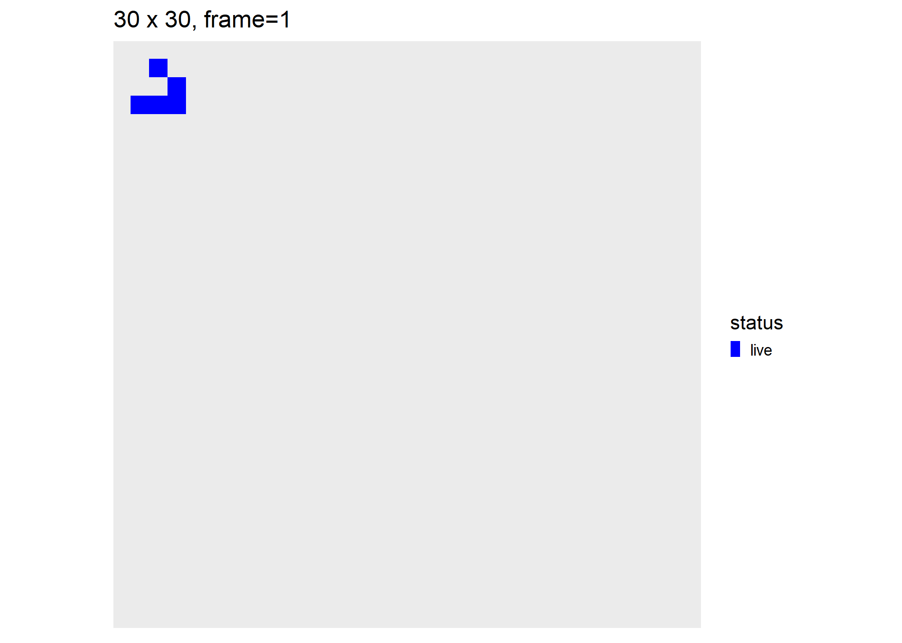

# Conway’s “Game of Life” w/ `tibble()` logic

The [Game of
Life](https://en.wikipedia.org/wiki/Conway%27s_Game_of_Life), also known
simply as Life, is a cellular automaton devised by the British
mathematician John Horton Conway in 1970.

## Survival rules:

  - A live cell survives if it has 2 or 3 neighbors, else it dies
  - A dead cell is “born” if it has exactly 3.

## R Implementation

The code below will use `tibbles()` and sparse matrices to evolve an
initial configuration of 100x100 cells, 10% of which are randomly
initialized as “alive”. The update logic is contained in file `conway.R`
included in the project.

``` r
suppressMessages(library(tidyverse))
suppressMessages(library(Matrix))
library(fs)
library(magick)
library(tictoc)
source("conway.R")
```

Create and plot random array (see `conway_utils.R`)

``` r
random_df(50,.1) %>% plot_df
```

<!-- -->

Run one iteration of a conway\_step (see `conway.R`)

``` r
random_df(50,.1) %>% conway_step %>% plot_df
```

<!-- -->

Conway simulation and plots. Main workhorse is `conway_step()` in the
“conway.R” file

``` r
set.seed(1)
side <- 64
df_sim_rand <- random_df(side,.33) %>% conway_sim(64)
```

Save it to animated
.gif

``` r
df_sim_rand %>% make_anim_gif("conway.gif")
```


# [Spaceship](https://en.wikipedia.org/wiki/Conway%27s_Game_of_Life) “gliders”

Build the simplest glider, place it on the top left corner of array.

``` r
df_glider0 <- tribble(~i,~j,
                        1,1,
                        2,1,
                        3,1,
                        3,2,
                        2,3) %>%
  mutate(status="live")
df_gliders <- df_glider0 %>%
  mutate(j=j+27)
attr(df_gliders,"width") <- 30

df_gliders %>% plot_df
```

<!-- -->

Evolve its position over 120 conway steps:

``` r
df_sim_gliders <- df_gliders %>% conway_sim(120)
```

Show the animated results

``` r
df_sim_gliders %>%
  make_anim_gif("gliders.gif",fps=6)
```


