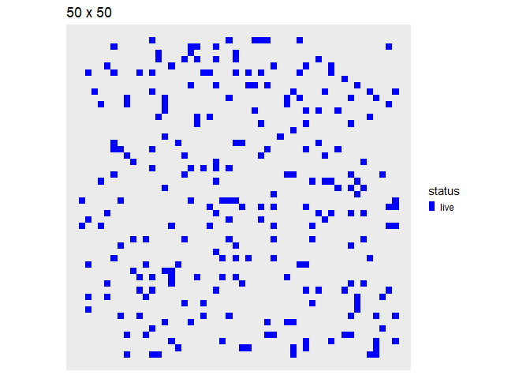

# Conway’s “Game of Life” w/ `tibble()` logic

The [Game of
Life](https://en.wikipedia.org/wiki/Conway%27s_Game_of_Life) is a
cellular automaton devised by the British mathematician John H. Conway
in 1970.

## Survival rules:

  - A live cell survives if it has 2 or 3 neighbors, else it dies
  - A dead cell is “born” if it has exactly 3 neighbors.

## R Implementation

The code below will use `tibbles()` and sparse matrices to evolve an
initial random configuration of alive cells. All update logic is in file
`conway.R` included in the project.

``` r
suppressMessages(library(tidyverse))
suppressMessages(library(Matrix))
library(fs)
library(magick)
library(tictoc)
```

All logic resides on this file:

``` r
source("conway.R")
```

Create and plot random array:

``` r
df_rand <- random_df(50,.1)
df_rand %>% plot_df
```

<!-- -->

Run one step of the Conway algo (see `conway.R`). Surviving cells are
shown “blue” and newborn ones “red” (see “Survival Rules” above):

``` r
df_rand %>% conway_step %>% plot_df
```

<!-- -->

Create 64 x 64 random array, 33% filled-out, evolve it over 64 Conway
steps:

``` r
set.seed(1)
side <- 64
df_sim_rand <- random_df(side,.33) %>% conway_sim(64)
```


## Spaceship Gliders

A [spaceship
glider](https://en.wikipedia.org/wiki/Spaceship_\(cellular_automaton\))
is a pattern which reappears after a certain number of generations
(period) in the same orientation but in a different position.

Here we will hand-pixelate the “light” glider and translate it to the
top-left corner of the array.

``` r
df_glider0 <- tribble(~i,~j,
                        1,1,
                        2,1,
                        3,1,
                        3,2,
                        2,3) %>%
  mutate(status="live")
df_gliders <- df_glider0 %>%
  mutate(j=j+27)
attr(df_gliders,"width") <- 30

df_gliders %>% plot_df
```

<!-- -->

Evolve its position over 120 Conway steps:

``` r
df_sim_glider <- df_gliders %>% conway_sim(120)
```

Notice its periodic motion:


## Gosper’s Glider Gun

A “gun” is a pattern w/ a main part that repeats periodically, like an
oscillator, and that also periodically emits spaceships.

Below we hand pixelate [Gosper’s Glider
Gun](https://en.wikipedia.org/wiki/Gun_\(cellular_automaton\)) and
translate it to the top-left corner:

``` r
df_glider_gun0 <-
  tribble(~i,~j,
          2,5,3,5,2,6,3,6,
          #
          12,4,12,5,12,6,13,3,13,7,14,2,14,8,
          15,2,15,8,16,5,17,3,17,7,
          18,4,18,5,18,6,19,5,
          #
          22,6,22,7,22,8,23,6,23,7,23,8,
          24,5,24,9,
          #
          26,4,26,5,26,9,26,10,
          #
          36,7,36,8,37,7,37,8) %>%
  mutate(status="live")
df_glider_gun <- df_glider_gun0 %>%
  mutate(j=j+54)
attr(df_glider_gun,"width") <- 64

df_glider_gun %>% plot_df
```

<!-- -->

Evolving its position over 240 Conway steps:

``` r
df_sim_gun <- df_glider_gun %>% conway_sim(240)
```

Gosper’s Gun is self-preserving and periodically spawns a stream of
light gliders:


